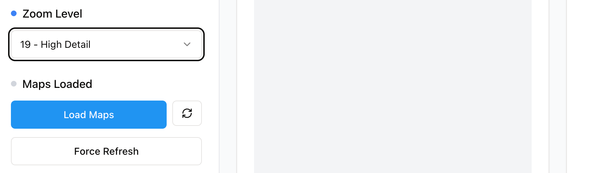
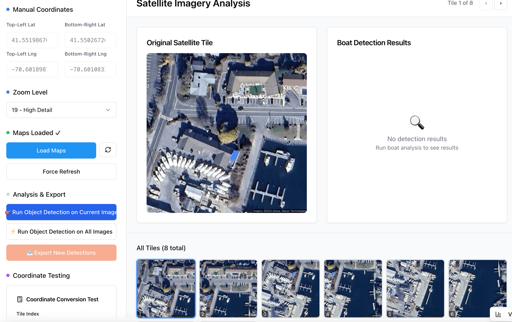
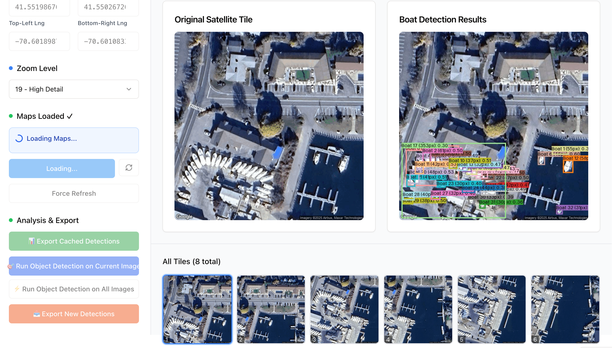
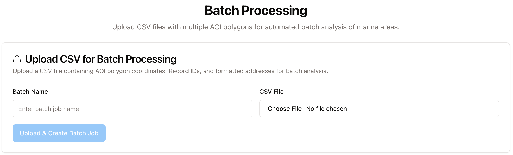
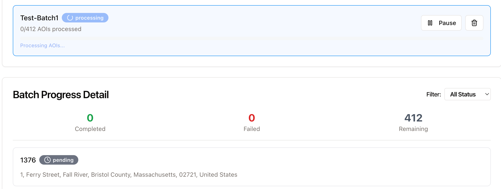
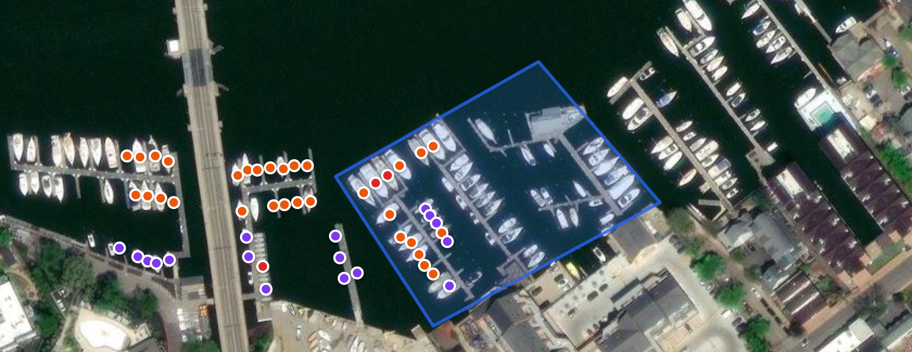

# Marina Analysis Platform User Guide
## Azure Maps - AI-Powered Boat Detection & Analysis

---

## Table of Contents
1. [Overview](#overview)
2. [Getting Started](#getting-started)
3. [Single Marina Analysis Workflow](#single-marina-analysis-workflow)
4. [Batch Processing Workflow](#batch-processing-workflow)
5. [Understanding Detection Results](#understanding-detection-results)
6. [Export and Data Analysis](#export-and-data-analysis)
7. [Tips & Best Practices](#tips--best-practices)
8. [Troubleshooting](#troubleshooting)

---

## Overview

**Marina Analysis Platform (Azure Maps)** is a comprehensive web-based application that combines Azure Maps satellite imagery with AI-powered computer vision to detect and analyze boats in marina areas. The platform provides both single-marina analysis and batch processing capabilities for large-scale marina surveys.

### Key Features
- ✅ **Azure Maps Integration** - High-resolution satellite imagery from Azure Maps API
- ✅ **AI-Powered Detection** - Vision Agent with OwlV2 object detection models
- ✅ **Polygon AOI Support** - Define custom areas of interest with coordinate polygons
- ✅ **Spatial Filtering** - Keeps only boats 70%+ inside AOI boundaries
- ✅ **Smart Deduplication** - Removes duplicate detections across tile boundaries (70% overlap threshold)
- ✅ **Batch Processing** - Process multiple marinas from CSV upload
- ✅ **Real-time Progress** - Live updates during detection processing
- ✅ **Comprehensive Export** - Excel files with detailed boat measurements and coordinates
- ✅ **Tile Caching** - 24-hour cache for improved performance

### Purpose

Marina Analysis Platform is **Phase 2** of the marina analysis workflow. Use it to:
1. Load satellite imagery for defined marina areas
2. Run AI detection to identify boats
3. Apply spatial filtering to remove out-of-bounds detections
4. Deduplicate overlapping detections
5. Export filtered results for verification and analysis

**Note:** This platform provides the detection engine. For visualizing results, use the Detection Visualizer application (Phase 3).

---

## Getting Started

### Initial Screen

When you first open Marina Analysis Platform, you'll see the main interface with navigation:


**Main Navigation:**
- **Single Analysis** - Analyze individual marinas with custom AOI
- **Batch Processing** - Process multiple marinas from CSV upload
- **File System** - Browse and manage generated files
- **System Cleanup** - Clear all data and reset

### Application Modes

#### Single Analysis Mode
Use this mode for:
- Testing individual marinas
- Fine-tuning AOI polygons
- Quick analysis of specific locations
- Development and debugging

#### Batch Processing Mode
Use this mode for:
- Processing multiple marinas at once
- Production-scale analysis
- Consistent processing across locations
- Time-efficient bulk operations

---

## Single Marina Analysis Workflow

### Step 1: Define Area of Interest (AOI)

#### 1.1 Enter Polygon Coordinates

The platform uses polygon coordinates to define the marina area.


**Source:** AOI coordinates come from the **GeoCapture (AOI Capture)** application export.

**Sample File:** `sample_data/6147-addresses_export-AOI-Capture-download.csv`

**How to Get Polygon Coordinates:**
1. Open `6147-addresses_export-AOI-Capture-download.csv` in a text editor
2. Find the **"Polygon Coordinates"** column (column G)
3. Copy the entire JSON array
4. Paste into the **"AOI Polygon"** text area in the platform

**Example - RecordID 6147 (Annapolis Marina):**
- **Address:** 410 Severn Avenue, Annapolis, MD 21403
- **RecordID:** 6147
- **Polygon Coordinates:**
```json
[{"lat":38.97220835300037,"lng":-76.48325928004924},{"lat":38.97275095846031,"lng":-76.48386017213753},{"lat":38.97230852662895,"lng":-76.48486344732065},{"lat":38.9717356464176,"lng":-76.48437996086551},{"lat":38.971853566928345,"lng":-76.48421426926097},{"lat":38.97194121930017,"lng":-76.48388699767717},{"lat":38.97197461065137,"lng":-76.48372604443924},{"lat":38.971903654011264,"lng":-76.48366166314406},{"lat":38.971966262815066,"lng":-76.48353290055373},{"lat":38.97200800198685,"lng":-76.48347388436649},{"lat":38.97209982807822,"lng":-76.48348997969026},{"lat":38.972141567171306,"lng":-76.48342023328719}]
```

**Steps:**
1. Paste polygon coordinates in the **"AOI Polygon"** text area
2. Or click **"Load Default"** to use built-in example
3. Coordinates are automatically validated
4. System calculates bounding box from polygon

#### 1.2 Set Zoom Level


**Zoom Level Options:**
- **19**: Maximum detail (~1.19m per pixel) - Best for small marinas
- **20**: Highest resolution (~0.60m per pixel) - Best quality but more tiles
- **18**: Wider view (~2.39m per pixel) - Faster processing

**Recommended:** Zoom level 19 provides excellent balance between detail and performance.

---

### Step 2: Load Satellite Maps

#### 2.1 Fetch Satellite Imagery



**Action:** Click the **"Load Maps"** button to load satellite imagery for the pasted polygon coordinates.

1. System calculates optimal tile grid (with 25% overlap)
2. Fetches tiles from Azure Maps API
3. Stores tiles with 24-hour cache
4. Displays tile grid in the interface

**What Happens:**
- Bounding box calculated from polygon
- Tile grid generated with 25% overlap for complete coverage
- Each tile fetched at 640x640 pixels
- Tiles cached to avoid redundant API calls

#### 2.2 Review Satellite Tiles


After loading, the **prediction side will be empty** (no detections yet), but you'll see a **group of overlapping image tiles**. The system uses **adaptive logic** to calculate the optimal number and arrangement of tiles needed to cover the entire polygon area.

**What You'll See:**
- **Tile grid** showing all fetched satellite images
- **Overlapping tiles** (25% overlap between adjacent tiles)
- **Tile numbers** for reference (e.g., Tile 0, Tile 1, Tile 2, etc.)
- **Input images** on the left (original satellite tiles)
- **Empty prediction area** on the right (will show annotated results after detection)

**Typical Grid:** 2-8 tiles depending on marina size (e.g., Annapolis Marina uses 2 tiles covering the polygon area)

---

### Step 3: Run Boat Detection

#### 3.1 Start Detection Process



**Action:** Click the **"Run Detection"** button to trigger boat detection. You have two options:

1. **Run Detection on Single Image**: Process only the currently selected tile
   - Use this to test/preview detection on one tile
   - Faster for quick checks
   - Results shown for selected tile only

2. **Run Detection on All Images**: Process all loaded tiles
   - Use this for complete marina analysis
   - Processes each tile sequentially
   - Recommended for final results

**Processing Details:**
- Uses Vision Agent with OwlV2 model
- Processes each 640x640 pixel tile
- Detects boats with bounding boxes
- Calculates boat dimensions in meters
- Converts pixel coordinates to latitude/longitude

#### 3.2 Monitor Progress and View Results



**Real-Time Display:**
As detection runs, you'll see results appear with:
- **Input tile on the left**: Original satellite image
- **Annotated prediction on the right**: Same image with green bounding boxes around detected boats
- **Boat dimensions**: Length and width displayed on each detection
- **Tile-by-tile processing**: Results appear as each tile completes

**Progress Indicators:**
- Current tile being processed
- Completion percentage
- Number of boats detected so far
- Processing time estimates

**Typical Performance:**
- **2-tile grid**: 1-2 minutes total processing
- **Average**: 50-55 boats detected per tile
- **Total detections**: 100-110 boats (before filtering, e.g., RecordID 6147 had 106 raw detections)

---

### Step 4: Review Detection Results

#### 4.1 View Annotated Images


After detection completes:
- **Green bounding boxes** show detected boats
- **Labels** display boat dimensions
- **Tile selector** allows navigation between tiles
- **Statistics** show detection counts

**Bounding Box Information:**
- Length and width in meters
- Confidence score
- Object classification

#### 4.2 Check Detection Statistics

<div style="display: flex; align-items: flex-start; gap: 20px;">
<div style="flex: 0 0 48%;">


</div>
<div style="flex: 1;">

**Statistics Panel Overview:**

The detection statistics panel displays the complete analysis pipeline, showing how raw detections are filtered and deduplicated to produce final results.

**Key Metrics Displayed:**

- **Total Raw Detections**: All boats found across all tiles (includes duplicates and out-of-bounds detections)
- **AOI Filtered**: Boats with 70%+ of their bounding box inside the polygon boundary
- **After Deduplication**: Final unique boats after removing duplicates in overlapping tile areas (70% overlap threshold)
- **Processing Time**: Total time taken for detection and filtering
- **Tiles Processed**: Number of satellite tiles analyzed

**Understanding the Numbers:**

The statistics show the reduction at each stage:
1. **Raw detections** include all AI predictions across tiles
2. **AOI filtering** removes boats outside marina boundaries
3. **Deduplication** removes the same boat detected in multiple overlapping tiles
4. **Final count** represents unique boats within the marina polygon

</div>
</div>

**Example Results (RecordID 6147 - Annapolis Marina):**
```
Total Raw Detections: 106 boats (across 2 tiles)
  - Tile 0 (tile1): 51 boats
  - Tile 7 (tile2): 55 boats
AOI Filtered: ~55 boats (boats inside polygon)
After Deduplication: ~55 boats (final count)
```

**Sample Files:**
- `sample_data/6147-boat-detections-tile1-export.csv` - 51 detections from Tile 0
- `sample_data/6147-boat-detections-tile2-export.csv` - 55 detections from Tile 7
- `sample_data/6147-Detection-results.xlsx` - Final filtered results (~55 boats)

---

### Step 5: Export Filtered Results

#### 5.1 Download Excel File


1. Click **"Export AOI Filtered Results"** button
2. System applies:
   - Spatial filtering (70% inside AOI)
   - Deduplication (70% overlap threshold)
3. Excel file downloads automatically
4. Filename format: `boat-detections-[timestamp].xlsx` or `[RecordID]-Detection-results.xlsx`

**Sample Output File:** `sample_data/6147-Detection-results.xlsx`

**Excel Columns:**
- **Type**: Vessel classification (small/medium/large)
- **Latitude**: GPS latitude (15 decimal places)
- **Longitude**: GPS longitude (15 decimal places)
- **Length (m)**: Boat length in meters
- **Width (m)**: Boat width in meters
- **Polygon Coords**: Bounding box coordinates in TL/TR/BR/BL format

**Sample Rows from 6147-Detection-results.xlsx:**
```
Type: medium
Latitude: 38.972417739218200
Longitude: -76.484367578396000
Length (m): 18.5
Width (m): 7.4

Type: medium
Latitude: 38.972377113895500
Longitude: -76.485816145568300
Length (m): 19.1
Width (m): 7.6

Type: large
Latitude: 38.972305853027400
Longitude: -76.484594586261600
Length (m): 20.0
Width (m): 8.0
```

**Note:** This Excel file is the **final output** used in the Detection Visualizer application for visualization and verification.

---

## Batch Processing Workflow

### Step 1: Prepare CSV File

#### 1.1 CSV Format Requirements

The batch processing feature requires a CSV file exported from **GeoCapture** with marina AOI data.

**Sample File:** `sample_data/6147-addresses_export-AOI-Capture-download.csv`

**Required Columns:**
- **RecordID** - Unique marina identifier (alphanumeric, e.g., 6147, MAR-001, ANN-6147) - **MUST BE ADDED MANUALLY**
- **Address** - Marina address (e.g., "410 Severn Avenue, Annapolis, MD 21403")
- **Geocode Latitude** - Center point latitude (e.g., 38.97167)
- **Geocode Longitude** - Center point longitude (e.g., -76.48337)
- **Polygon Coordinates** - JSON array of polygon points (required for AOI)
- **Formatted Address** - Formatted address from geocoding

**Optional Columns:**
- Top-Left, Bottom-Right (bounding box)
- Status, Geocoded At, Bounding Box Captured At

**Important Note about RecordID:**
> ⚠️ The **RecordID** column must be **manually added** to the CSV file after exporting from GeoCapture (AOI Capture app). GeoCapture exports do not include RecordID by default.
>
> **Why Manual Addition is Required:**
> - Many different marinas can have the same RecordID in source data
> - Same marina can appear with different RecordIDs
> - Manual assignment ensures each marina has a unique, traceable identifier
> - RecordID is used in output filenames: `[RecordID]-Detection-results.xlsx`

#### 1.2 Real CSV Example

From `6147-addresses_export-AOI-Capture-download.csv`:

```csv
RecordID,Address,Geocode Latitude,Geocode Longitude,Polygon Coordinates,Formatted Address
6147,"410 Severn Avenue
Annapolis, MD 21403",38.97167,-76.48337,"[{""lat"":38.97220835300037,""lng"":-76.48325928004924},{""lat"":38.97275095846031,""lng"":-76.48386017213753},{""lat"":38.97230852662895,""lng"":-76.48486344732065},{""lat"":38.9717356464176,""lng"":-76.48437996086551},{""lat"":38.971853566928345,""lng"":-76.48421426926097},{""lat"":38.97194121930017,""lng"":-76.48388699767717},{""lat"":38.97197461065137,""lng"":-76.48372604443924},{""lat"":38.971903654011264,""lng"":-76.48366166314406},{""lat"":38.971966262815066,""lng"":-76.48353290055373},{""lat"":38.97200800198685,""lng"":-76.48347388436649},{""lat"":38.97209982807822,""lng"":-76.48348997969026},{""lat"":38.972141567171306,""lng"":-76.48342023328719}]","410 Severn Ave, Annapolis, MD 21403, USA"
```

**Key Points:**
- RecordID **6147** uniquely identifies this marina
- Address can span multiple lines (use quotes)
- Polygon Coordinates must use double-escaped quotes (`""`)
- This is the **same file** used for Single Analysis (just paste the polygon coordinates)

---

### Step 2: Upload and Process

#### 2.1 Upload CSV File



1. Navigate to **Batch Processing** tab
2. Click **"Upload CSV"** or drag and drop file
3. System parses marina records
4. Displays preview of marinas to process

#### 2.2 Configure Batch Settings


**Settings:**
- **Zoom Level**: 19 (recommended)
- **Processing Mode**: Sequential or parallel
- **Export Format**: Excel with all detections

#### 2.3 Start Batch Processing



1. Review marina list
2. Click **"Start Batch Processing"**
3. System processes each marina sequentially:
   - Loads satellite tiles
   - Runs AI detection
   - Applies filtering
   - Generates export file

**Progress Display:**
- Current marina being processed
- Overall batch completion percentage
- Individual marina status
- Estimated time remaining

---

### Step 3: Download Batch Results

#### 3.1 Individual Marina Exports

After batch processing completes:
- Each marina generates separate Excel file
- Files named by RecordID: `[RecordID]-Detection-results.xlsx`
- All files available in File System tab

**Example Output:**
- `6147-Detection-results.xlsx` - Annapolis Marina (RecordID 6147) with ~55 filtered boats

**File Location:**
Navigate to **File System** tab → `exports/` folder → Download individual files

#### 3.2 Consolidated Results

Optionally download:
- **Summary CSV**: All marinas' detection counts
- **Combined Excel**: All detections in single file
- **Statistics Report**: Processing metrics

---

## Understanding Detection Results

### Spatial Filtering (AOI)



**How It Works:**
1. Each detected boat has 4 corner points (bounding box)
2. System checks how many corners are inside AOI polygon
3. Uses ray-casting algorithm for point-in-polygon test
4. Requires 75% of corners (3 out of 4) inside to keep detection
5. Filters out boats not meeting threshold

**Why 70%?**
- Accounts for boats partially at dock edges
- Balances inclusivity vs. accuracy
- Reduces false positives from adjacent areas

### Deduplication Process


**Overlap Detection:**
1. Sort all boats by confidence score (highest first)
2. Compare each boat with remaining boats
3. Calculate polygon overlap percentage
4. Remove boats with >70% overlap with higher-confidence detections
5. Preserve only unique boats

**Why Needed?**
- Tiles overlap by 25% for complete coverage
- Same boat may appear in multiple tiles
- Deduplication ensures accurate count

### Boat Size Classification

**Categories:**
- **Small**: < 15 meters length
- **Medium**: 15-30 meters length
- **Large**: 30+ meters length

**Measurement Accuracy:**
- Length: ±0.5 meters
- Width: ±0.3 meters
- Based on pixel resolution and zoom level

---

## Export and Data Analysis

### Excel Export Format

#### Column Descriptions

| Column | Description | Example |
|--------|-------------|---------|
| **Type** | Boat size classification | medium |
| **Latitude** | Center point latitude | 41.489523456789012 |
| **Longitude** | Center point longitude | -71.312771234567890 |
| **Length (m)** | Boat length in meters | 18.5 |
| **Width (m)** | Boat width in meters | 5.2 |
| **Polygon Coords** | Complete bounding box | TL: lat,lng \| TR: lat,lng \| BR: lat,lng \| BL: lat,lng |

#### Using Exported Data

**Import to Detection Visualizer:**
1. Save Excel file from this platform
2. Open Detection Visualizer application
3. Upload Excel file to visualize results
4. Verify detections on map overlay

**Data Analysis:**
- Calculate marina occupancy rates
- Analyze boat size distribution
- Track changes over time (multi-temporal analysis)
- Compare marinas by capacity

---

## Tips & Best Practices

### AOI Polygon Guidelines

**Drawing Polygons:**
1. **Coverage**: Include all dock areas and slips
2. **Precision**: Use 6-12 points for accuracy
3. **Boundaries**: Stay within marina property
4. **Testing**: Start with default example to understand format

**Coordinate Format:**
```json
[
  {"lat": 41.48952, "lng": -71.31277},
  {"lat": 41.48988, "lng": -71.31234},
  {"lat": 41.48975, "lng": -71.31198},
  {"lat": 41.48939, "lng": -71.31241}
]
```

### Zoom Level Selection

| Zoom | Resolution | Use Case | Processing Time |
|------|------------|----------|-----------------|
| 18 | ~2.39m/pixel | Quick surveys | Fast |
| 19 | ~1.19m/pixel | Standard analysis | Medium |
| 20 | ~0.60m/pixel | High detail | Slow |

**Recommendation:** Use zoom 19 for balanced performance and accuracy.

### Batch Processing Tips

1. **Test First**: Run single marina before batch
2. **Group Similar**: Process marinas by region
3. **Monitor Progress**: Check for failed analyses
4. **Export Regularly**: Download results incrementally
5. **Cleanup Between**: Clear cache between large batches

### Performance Optimization

**Speed Up Processing:**
- Use zoom 18-19 (avoid 20 unless necessary)
- Process marinas during off-peak hours
- Clear cache before large batches
- Batch similar-sized marinas together

**Reduce API Costs:**
- Reuse cached tiles (24-hour duration)
- Minimize zoom level where acceptable
- Plan batch processing efficiently

---

## Troubleshooting

### Issue: Maps Won't Load

**Symptoms:** "Failed to load maps" error, no satellite tiles appear

**Solutions:**
1. **Check API Key**: Verify Azure Maps API key is configured
2. **Check Coordinates**: Ensure polygon coordinates are valid
3. **Network Connection**: Verify internet connectivity
4. **API Limits**: Check if daily API quota exceeded
5. **Polygon Format**: Validate JSON array format

### Issue: Detection Fails

**Symptoms:** Detection starts but errors out, no results generated

**Solutions:**
1. **Python Environment**: Ensure Vision Agent is installed
2. **Memory**: Check available system memory (needs 4GB+ free)
3. **Tiles Loaded**: Verify satellite tiles loaded successfully
4. **Model Download**: First run downloads OwlV2 model (may take time)
5. **Retry**: Click detection button again after error

### Issue: No Boats Detected

**Symptoms:** Detection completes but shows 0 boats

**Possible Causes:**
- Marina has no boats currently
- Zoom level too low (boats too small)
- Tiles show wrong location
- Imagery outdated (boats moved)

**Solutions:**
1. **Verify Location**: Check satellite tiles show correct marina
2. **Increase Zoom**: Try zoom 19 or 20 for better resolution
3. **Check Imagery**: Satellite images may be from season with fewer boats
4. **Test with Known Marina**: Try default Newport example

### Issue: Too Many Detections Filtered Out

**Symptoms:** Raw detections are high but AOI filtered count is very low

**Explanation:**
- AOI polygon may be too small
- Detections outside marina boundaries
- Spatial filtering working correctly

**Solutions:**
1. **Review Polygon**: Check AOI covers all dock areas
2. **Adjust in GeoCapture**: Redraw polygon if needed
3. **Check Annotated Images**: Verify detections are actually outside
4. **Expected Behavior**: Some filtering is normal for edge detections

### Issue: Duplicate Boats in Export

**Symptoms:** Same boat appears multiple times in Excel export

**Explanation:**
- Deduplication threshold may need adjustment
- Boats at tile boundaries can be tricky

**Solutions:**
1. **Check Overlap**: Look at annotated images from adjacent tiles
2. **Accept Some Duplicates**: Perfect deduplication is challenging
3. **Manual Review**: Use Detection Visualizer to verify
4. **Report Issue**: If consistent problem, adjust deduplication threshold in code

### Issue: Batch Processing Stuck

**Symptoms:** Batch processing stops mid-way, no progress updates

**Solutions:**
1. **Check Logs**: Look for error messages in console
2. **Restart Application**: Refresh page and try again
3. **Process Individually**: Run problem marinas separately
4. **Reduce Batch Size**: Process fewer marinas at once
5. **System Cleanup**: Clear all data and restart

---

## Quick Reference Card

### Complete Single Analysis Workflow

1. **Define AOI** → Paste polygon coordinates or load default
2. **Set Zoom** → Select zoom level 19 (recommended)
3. **Load Maps** → Click "Load Maps" to fetch satellite tiles
4. **Run Detection** → Click "Run Detection on All Images"
5. **Review Results** → Check annotated images and statistics
6. **Export Data** → Click "Export AOI Filtered Results"
7. **Verify** → Upload to Detection Visualizer for visual confirmation

### Complete Batch Processing Workflow

1. **Prepare CSV** → Export marinas from GeoCapture
2. **Upload** → Navigate to Batch Processing tab, upload CSV
3. **Configure** → Set zoom level and processing options
4. **Process** → Click "Start Batch Processing"
5. **Monitor** → Watch progress for each marina
6. **Download** → Collect all Excel exports from File System
7. **Analyze** → Compile results for reporting

### Keyboard Shortcuts

| Key | Action |
|-----|--------|
| `Ctrl/Cmd + L` | Load Maps |
| `Ctrl/Cmd + D` | Run Detection |
| `Ctrl/Cmd + E` | Export Results |
| `Left/Right Arrow` | Navigate tiles |
| `Escape` | Close dialogs |

---

## Appendix: Sample Workflow

### Example: Processing Newport Marina

**Time Required:** ~5 minutes

**Step-by-Step:**

1. **Minute 0-1:** Open platform, paste Newport polygon coordinates
2. **Minute 1-2:** Set zoom to 19, click "Load Maps"
3. **Minute 2:** Review 8 satellite tiles covering marina
4. **Minute 2-3:** Click "Run Detection on All Images"
5. **Minute 3-5:** AI processes tiles, 411 boats detected
6. **Minute 5:** Review statistics: 334 boats after filtering
7. **Minute 5:** Click "Export AOI Filtered Results"
8. **Result:** Excel file with 334 boats, ready for verification

### Example: Batch Processing 10 Marinas

**Time Required:** ~30-45 minutes

**Step-by-Step:**

1. **Minute 0-2:** Export 10 marinas from GeoCapture as CSV
2. **Minute 2-5:** Upload CSV to Batch Processing tab
3. **Minute 5-40:** System processes each marina (3-4 min per marina)
4. **Minute 40-45:** Download all Excel files from File System
5. **Result:** 10 Excel files with detection results for all marinas

---

## System Requirements

### Browser Compatibility
- ✅ Chrome 90+ (Recommended)
- ✅ Firefox 88+
- ✅ Edge 90+
- ✅ Safari 14+

### Minimum Specifications
- **RAM**: 8GB minimum, 16GB recommended
- **Internet**: 10+ Mbps broadband
- **Display**: 1920 x 1080 resolution recommended

### Server Requirements
- **Node.js**: 20+
- **Python**: 3.11
- **PostgreSQL**: 14+
- **Storage**: 10GB+ for tile cache

---

## Related Documentation

- **CLAUDE.md** - Developer guidance for the codebase
- **Setup-Application-Locally.md** - Installation and setup guide
- **DEPLOYMENT.md** - Production deployment instructions
- **PRODUCTION_DEPLOYMENT_GUIDE.md** - Advanced deployment guide

## Workflow Integration

Marina Analysis Platform is **Phase 2** in the complete workflow:

1. **Phase 1:** GeoCapture (AOI Capture) - Draw marina polygons
2. **Phase 2:** Marina Analysis Platform - Run AI detection ⬅ *You are here*
3. **Phase 3:** Detection Visualizer - Verify and visualize results

### When to Use This Platform

✅ **Use Marina Analysis Platform when:**
- You need to detect boats in satellite imagery
- You have marina AOI polygons from GeoCapture
- You want to process single or multiple marinas
- You need filtered, deduplicated detection data
- You want Excel exports for analysis

❌ **Use GeoCapture Instead when:**
- You need to define new marina AOI polygons
- You're capturing bounding boxes for marinas
- You need to geocode marina addresses

❌ **Use Detection Visualizer Instead when:**
- You want to visualize detection results on maps
- You need to verify detections are within AOI
- You want location-based verification without processing

---

**Version:** 1.0
**Last Updated:** October 2025
**Application:** Marina Analysis Platform - Azure Maps
**Project:** Y3NU SafeHarbor Final Handover
